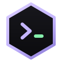

<div align="center">
  
  <h1>Hive</h1>
  <p><strong>A terminal-first code editor for the agentic era.</strong></p>
  <p><em>A fork of <a href="https://github.com/zed-industries/zed">Zed</a>.</em></p>
</div>

---

Most editors treat the terminal as a drawer at the bottom. But when you work with coding agents — Claude Code, Codex, aider — the terminal *is* the workspace, and the editor is what you open to check the agent's work.

Hive inverts the layout: a window opens as a terminal, sessions are first-class, and the editor shows up beside them when you need it.

## What it does

**Sessions, not tabs.** A left rail lists your projects and the terminal sessions inside them, each with a live status dot — running, idle, or waiting for input. Run several agents across several repos and see at a glance which one needs you.

**It tells you when an agent finishes.** A native notification when a long command completes in an unfocused window; an in-app toast when the window is focused. No more polling a terminal to see if the agent is done.

**The file tree follows your terminal.** `cd` somewhere and the right-hand tree re-roots there — it reads the filesystem directly, so it costs nothing and never restarts your language servers.

**Git where you're already working.** Per-file keep/undo and approve-all-and-commit in the diff view, per-session diff stats in the sidebar, plus the stash viewer and commit graph a keystroke away.

**Pull requests without leaving.** A read-only PR/MR viewer backed by the `gh` and `glab` CLIs — no API tokens to store, since the CLIs already handle auth.

**Worktrees as a first-class move.** One shortcut creates a git worktree and drops a terminal session into it, so parallel agent work doesn't collide.

## Keys worth knowing

| | |
|---|---|
| `cmd-t` | New terminal session |
| `cmd-shift-n` | New git worktree + session |
| `cmd-d` | Review uncommitted changes |
| `cmd-e` | Open a file beside the terminal |
| `ctrl-shift-t` | Toggle the file tree |
| `ctrl-shift-s` | Stash viewer |
| `ctrl-shift-h` | Commit graph |
| `cmd-shift-r` | Saved commands (`.zed/tasks.json`) |
| `ctrl-alt-i` | Multi-line terminal input |

## Building

Requires Rust (the pinned toolchain installs itself), Xcode with the Metal toolchain, and CMake.

```sh
xcodebuild -downloadComponent MetalToolchain   # once
cargo run -p zed                               # produces the `hive` binary
script/bundle-mac -d                           # build Hive.app
```

Hive keeps its own config, so it won't touch an existing Zed install:
`~/.config/hive`, `~/Library/Application Support/Hive`, `~/Library/Logs/Hive`.

## Status

Working, but young — expect rough edges. Shell integration emits OSC 133 and command boundaries are tracked, though block rendering isn't wired to the UI yet. GitLab support in the PR viewer is written but less tested than GitHub.

Zed's built-in AI features (agent panel, inline assist, edit prediction) are disabled by default — Hive's premise is that agents run as CLI processes in your terminals.

## Credit and license

Hive is a fork of [Zed](https://github.com/zed-industries/zed) by Zed Industries, and essentially all of the editor — the GPUI framework, the editor core, LSP, terminal, git integration — is their work. Hive changes the shell around it.

Licensed under **GPL-3.0**, inherited from Zed. See [LICENSE-GPL](LICENSE-GPL).
